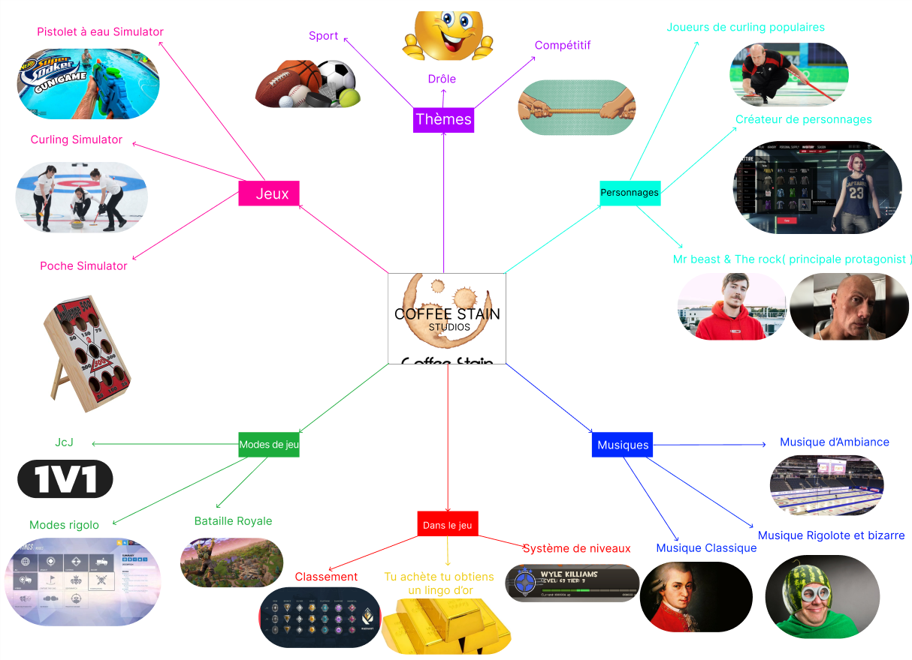

# Cours 12
## Préparation de la présentation 3 

Notre projet consiste a créé un jeu rigolo pour but compétitif afin de s'amuser entre joueurs. Nous cherchons à atteindre un niveau chaotique assez élever dans notre jeu qu'il en devient divertissant et addictif. La création de personnages rajoutera une couche de choses drôles dans le mode multijoueur qui insistera les personnes à le jouer, sachant que cette compagnie a créé des jeux autant rigolos dans le passé, ce jeu sera la bienvenue.
