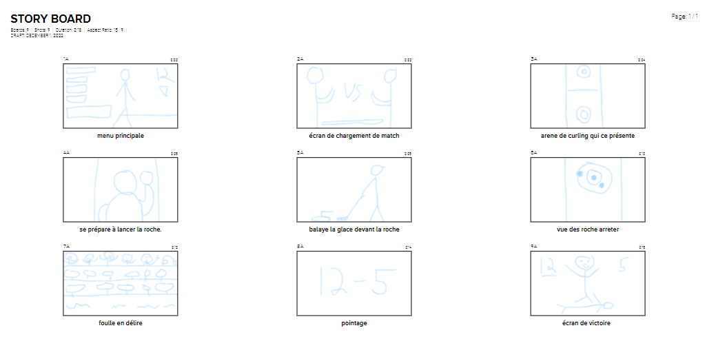
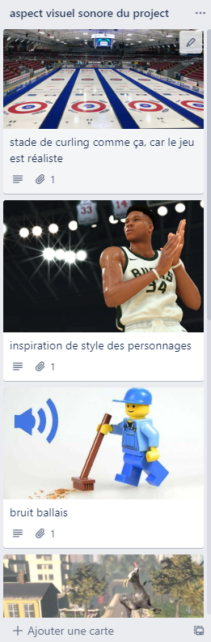

# Cours 14
## Plan de la présentation 3
Durée: 8 à 10 minutes

### Résumer votre projet en une phrase
Un jeu de curling révolutionnaire et rigolo
### Description du projet 
Décrivez les grandes lignes de votre projet. 

### Schéma du projet ou scénarimage

### Moodboard

### Tâches
* Création des physique
* Mise en route de serveurs
* Mise en route des services
* Application du ray tracing
* Création des personnages
* Création des cartes
* Création des objets
* Construire de toutes pièces un public fou en délire qui lève les bras et réagit au pointage
